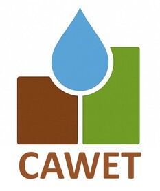

# CAWET <a href="https://forge.inrae.fr/umr-g-eau/cawet"></a>

<!-- badges: start -->

[](https://forge.inrae.fr/umr-g-eau/cawet.git)
[](https://inrae.r-universe.dev/CAWET)
[](https://cran.r-project.org/web/licenses/AGPL-3)
[](https://forge.inrae.fr/umr-g-eau/cawet/-/pipelines)
[](https://umr-g-eau.pages-forge.inrae.fr/cawet/coverage.html)
<!-- badges: end -->

**Calculation of Agricultural Water Needs and Evapotranspiration**

The goal of CAWET is to calculate theoretical irrigation water
consumption over a territory. CAWET extracts, models and analyzes
agro-climatic data to produce maps, graphics and comparative outputs
across different scenarios. The workflow includes data extraction from
online databases (via [RADIS](https://umr-g-eau.pages-forge.inrae.fr/radis/)),
modeling (primarily using [CropWat](https://umr-g-eau.pages-forge.inrae.fr/cropwat/)), and
visualization of results through graphics and maps.

*Le but de CAWET est de calculer la consommation théorique d’eau
d’irrigation sur un territoire. CAWET extrait, modélise et analyse des
données agroclimatiques pour produire des cartes, des graphiques et des
résultats comparatifs selon différents scénarios. Le flux de travail
inclut l’extraction de données depuis des bases en ligne (via
[RADIS](https://umr-g-eau.pages-forge.inrae.fr/radis/)), la
modélisation (principalement avec [CropWat](https://umr-g-eau.pages-forge.inrae.fr/cropwat/))
 et la visualisation des résultats sous forme de graphiques et de cartes.*

## Installation

### For Windows users - *pour les utilisateurs Windows*

Download [install_cawet.bat](https://forge.inrae.fr/umr-g-eau/cawet/-/raw/main/dev/install_cawet.bat?inline=false), then run it from the folder where you want CAWET to be installed.
This script automatically downloads and installs CAWET (including R) in a subfolder named `CAWET`.
On some systems, Windows SmartScreen or your antivirus may ask for confirmation before running the script.

*Téléchargez [install_cawet.bat](https://forge.inrae.fr/umr-g-eau/cawet/-/raw/main/dev/install_cawet.bat?inline=false), puis exécutez-le depuis le dossier où vous souhaitez installer CAWET.*
*Ce script télécharge et installe automatiquement CAWET (y compris R) dans un sous-dossier nommé `CAWET`.*
*Sur certains systèmes, Windows SmartScreen ou l’antivirus peuvent demander une confirmation avant l’exécution du script.*

### For R users (all platforms) - *pour les utilisateurs de R (toutes les plateformes)*

Install the CAWET package from INRAE R-universe:

``` r
install.packages(
  'CAWET',
  repos = c('https://inrae.r-universe.dev', 'https://cloud.r-project.org')
)
```

## Usage - *utilisation*

Please refere to [the tutorial vignette](articles/CAWET.html) for
detailed instructions on how to use CAWET.

*Veuillez vous référer à la [vignette tutoriel](articles/CAWET.html)
pour des instructions détaillées sur l’utilisation de CAWET.*

## 🙏 Acknowledgments - *Remerciements*

The **CAWET** package is being developed by the **[EACC
Chair](https://chaire-eacc.fr/)** and the **[Joint Research Unit “Water
Management, Actors, Territories” (UMR G-EAU)](https://g-eau.fr)**.

For all information, contact [cawet@chaire-eacc.fr](mailto:cawet@chaire-eacc.fr).

*Le package CAWET est développé par la [<strong>Chaire
EACC<strong>](https://chaire-eacc.fr/) et l’[<strong>Unité Mixte de
Recherche “Gestion de l’Eau, Acteurs, Territoires” (UMR
G-EAU)<strong>](https://g-eau.fr).*

Pour toute information, contacter [cawet@chaire-eacc.fr](mailto:cawet@chaire-eacc.fr).

<div id="logo-footer" style="align: center;">

<a href="https://inrae.fr" target="_blank">

</a> <a href="https://g-eau.fr" target="_blank">

</a> <a href="https://chaire-eacc.fr/" target="_blank">

</a>

</div>
